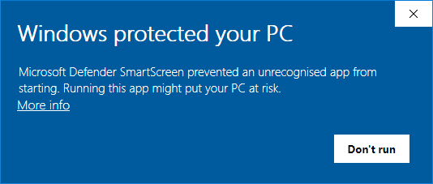

# docker-meshcentral <a href="https://github.com/vegardit/docker-meshcentral/" title="GitHub Repo"></a>

[](https://github.com/vegardit/docker-meshcentral/actions?query=workflow%3ABuild)
[](#license)
[](https://hub.docker.com/r/vegardit/meshcentral)
[](https://hub.docker.com/r/vegardit/meshcentral)
[](CODE_OF_CONDUCT.md)

1. [What is it?](#what-is-it)
1. [Configuration](#config)
   1. [Configuration Template File](#config-template-file)
   1. [Init Script](#init-script)
   1. [Signing Windows Agent EXEs](code-signing)
1. [License](#license)


## <a name="what-is-it"></a>What is it?

Opinionated docker image to run a [MeshCentral](https://meshcentral.com/info/) server to manage/access remote machines from within a browser.

It is automatically built **daily** to include the latest OS security fixes.


## <a name="config"></a>Configuration

Filesystem layout inside the docker container is as follows:
```asciidoc
/opt/
 |- run.sh                  -> container entrypoint script
 |- meshcentral/            -> MeshCentral installation root
    |- node_modules/        -> MeshCentral's binaries and dependencies
    |- meshcentral-data/    -> config and state files
    |  |- config.json       -> main configuration file
    |- meshcentral-files/   -> uploaded user files
```

To test-run MeshCentral with the default configuration execute:
```bash
docker run -it \
  --name=meshcentral \
  --restart=unless-stopped \
  --publish 80:80 \
  --publish 443:443 \
  --publish 4443:4443 \
  vegardit/meshcentral:latest
```

### <a name="config-template-file"></a>Configuration Template File

Using the environment variable `CONFIG_TEMPLATE_FILE` a configuration template file can be specified that is parsed on container start.
All references to environment variables using the syntax `${ENVIRONMENT_VARIABLE_NAME}` will be replaced.
The processed file is then saved at `/opt/meshcentral/meshcentral-data/config.json`.

For example, given the following file on the docker host `/opt/data/templates/meshcentral-config-template.json`...
```json
{
  "$schema": "http://info.meshcentral.com/downloads/meshcentral-config-schema.json",
  "settings": {
    "cert": "${MC_HOSTNAME}",
    "sessionKey": "${MC_SESSION_KEY}",
    "webRTC": true,
    "wanOnly": true,
  },
  "domains": {
    "": {
      "certUrl": "https://${MC_HOSTNAME}/",
      "title2": "Vegard IT",
      "minify": true,
      "newAccounts": false,
      "mstsc": true,
    }
  }
}
```

... Meshcentral can then be started like this:
```php
docker run -it \
  --name=meshcentral \
  --restart=unless-stopped \
  --publish 80:80 \
  --publish 443:443 \
  --publish 4443:4443 \
  --env CONFIG_TEMPLATE_FILE="/opt/my-config-template.json" \
  --env MC_HOSTNAME="meshcentral.local" \
  --env MC_SESSION_KEY="Ca8ybTCVcLo3PZz2oXkNxpvY" \
  --volume /opt/data/templates/meshcentral-config-template.json:/opt/my-config-template.json:ro \
  vegardit/meshcentral:latest
```

### Init Script

Using the environment variable `INIT_SH_FILE` a bash script can be specified, that is [sourced](https://linuxize.com/post/bash-source-command/) during container start as part of the `run.sh` entrypoint script.

For example, given the following file on the docker host `/opt/data/templates/meshcentral-init.sh`...
```bash
MC_HOSTNAME="meshcentral.local"
MC_SESSION_KEY="Ca8ybTCVcLo3PZz2oXkNxpvY"
```

... Meshcentral can then be started like this:
```php
docker run -it \
  --name=meshcentral \
  --restart=unless-stopped \
  --publish 80:80 \
  --publish 443:443 \
  --publish 4443:4443 \
  --env CONFIG_TEMPLATE_FILE="/opt/my-config-template.json" \
  --env INIT_SH_FILE="/opt/my-init.sh" \
  --volume /opt/data/templates/meshcentral-config-template.json:/opt/my-config-template.json:ro \
  --volume /opt/data/templates/meshcentral-init.sh:/opt/my-init.sh:ro \
  vegardit/meshcentral:latest
```

### <a name="code-signing"></a>Signing Windows Agent EXEs

The MeshCentral Agent binaries for Windows are not digitally signed by default.

This means when Windows users download and try to install them, Microsoft Defender will intercept the execution attempt like this:



To prevent this, the binaries need to be signed with an [EV Code Signing certificate](https://docs.microsoft.com/en-us/windows-hardware/drivers/dashboard/get-a-code-signing-certificate). It is important to buy the pricier **EV** (aka Extended Validation) code signing certificate and not the regular considerably cheaper code signing certificates. See also https://security.stackexchange.com/questions/139347/smart-screen-filter-still-complains-despite-i-signed-the-executable-why

This docker images bundles the [osslsigncode](https://github.com/mtrojnar/osslsigncode) tool which can digitally sign Windows binaries.

To activate **osslsigncode** the environment variable `OSSLSIGNCODE_OPTS` must be specified containing the necessary parameters to sign the binaries.
**osslsigncode** will then automatically be invoked like this during container start:

```php
osslsigncode sign $OSSLSIGNCODE_OPTS -in meshcentral/agents/*.exe --out -in meshcentral/agents/*-signed.exe
```

To sign the binaries on container start Meshcentral can for example be started like this:
```php
docker run -it \
  --name=meshcentral \
  --restart=unless-stopped \
  --publish 80:80 \
  --publish 443:443 \
  --publish 4443:4443 \
  --env OSSLSIGNCODE_OPTS="-certs /opt/signing.crt -key /opt/signing.key -n 'My Company' -i https://mywebsite.com/" \
  --volume /opt/signing.crt:/opt/signing.crt:ro \
  --volume /opt/signing.key:/opt/signing.key:ro \
  vegardit/meshcentral:latest
```

Please consult **osslsigncode**'s [usage documentation](https://github.com/mtrojnar/osslsigncode#usage) for more details about the possible input parameters.

## Resources

- Config.json Schema: https://github.com/Ylianst/MeshCentral/blob/master/meshcentral-config-schema.json
- Installation Guide: https://info.meshcentral.com/downloads/MeshCentral2/MeshCentral2InstallGuide.pdf
- User Guide: https://info.meshcentral.com/downloads/MeshCentral2/MeshCentral2UserGuide.pdf


## <a name="license"></a>License

All files in this repository are released under the [Apache License 2.0](LICENSE.txt).

Individual files contain the following tag instead of the full license text:
```
SPDX-License-Identifier: Apache-2.0
```

This enables machine processing of license information based on the SPDX License Identifiers that are available here: https://spdx.org/licenses/.
